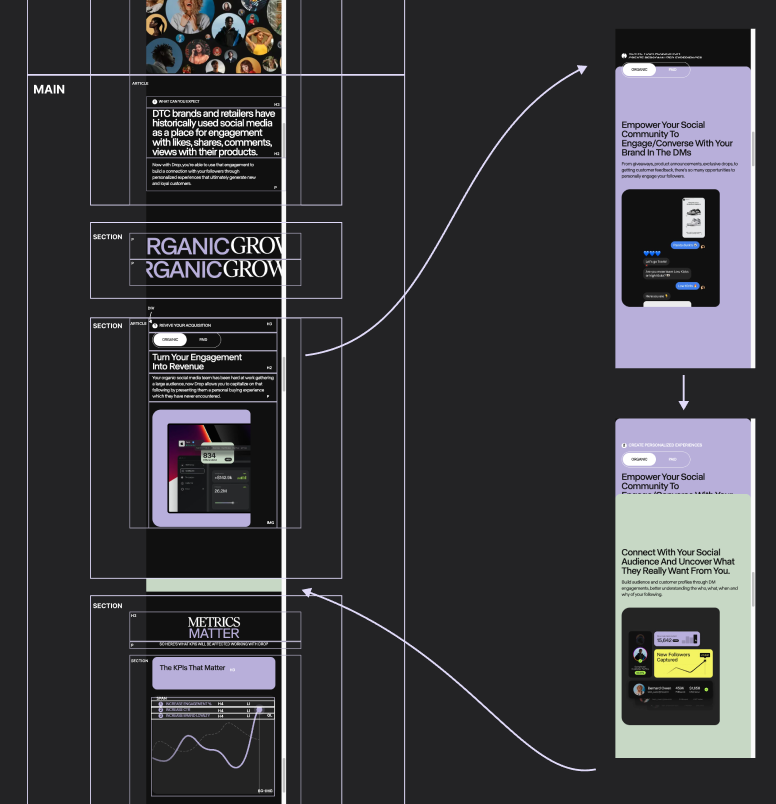
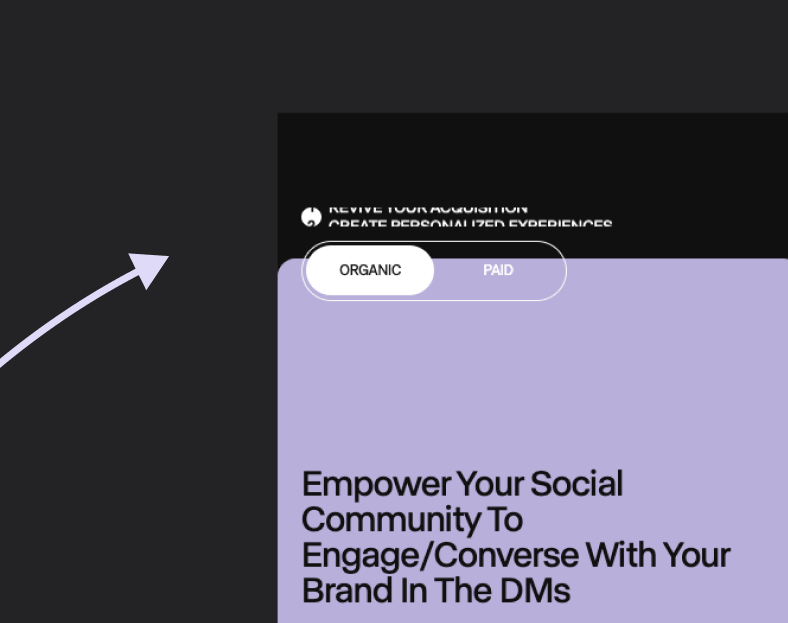

# Procesverslag
 ```javascript
console.log("hi");
```
Live site:
https://sf-duijkersloot.github.io/FED-map-Sep/

*Website is gemaakt voor mobiele viewport, dus scale aub je browser naar een geschikt mobiel fomaat.*


## De opdracht (voor school)
### Schoolvak: Front-end Development
 Kies een website en maak 2 pagina's volledig na en focus je op: ***responsive design*** of de ***surface plane***, dus micro-interacties, animations etc. 

#### Mijn focus:

  ```javascript
surfacePlane()
```
<hr>

[Link naar originele website](https://www.usedrop.io/organic-social)

<hr>

## Originele website screenshots
<details> 
 <summary>Screenshot 1<sup>e</sup> pagina (small screen)</summary>
  
</details>

<details>
 <summary>Screenshot 2<sup>e</sup> pagina (small screen)</summary>
  
</details>
 


## Breakdownschets

<details>
  <summary>Breakdownschets van de pagina's voor de html opbouw</summary>

  ### de hele pagina: 
  

  ### dynamisch deel (bijv menu): 
  

  ### wellicht nog een dynamisch deel (bijv filter): 
  

</details>

<hr>

## Resultaat
Ik denk dat ik de mobiele versie van de drop-site aardig heb kunnen namaken. Het was wel een uitdaging om de micro-interacties goed te krijgen, maar ik heb mijn best gedaan. Over het algemeen ben ik tevreden met hoe het eruitziet en werkt op mobiele devices.

### Cijfer: 10
